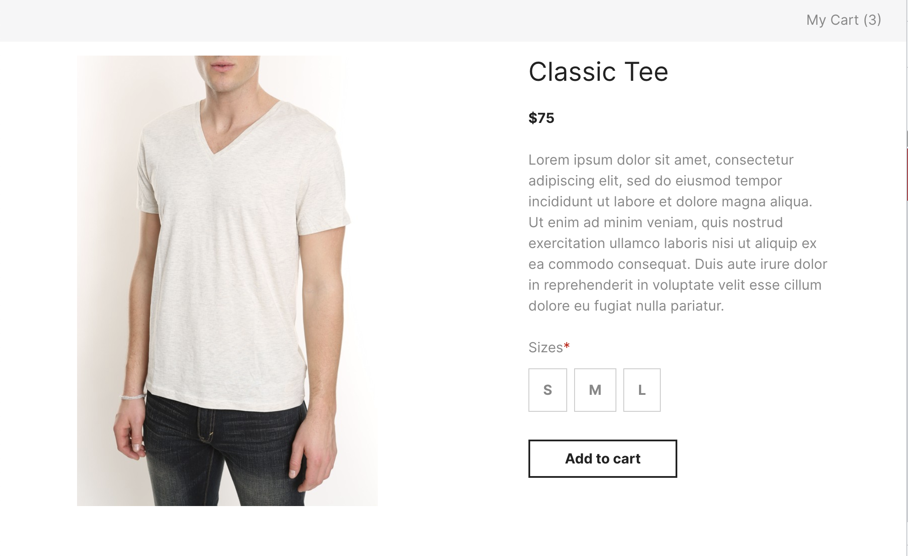

# Moustache Republic

This is a simple project built with React and TypeScript.



## [Live Demo](https://main--exquisite-babka-aac0b7.netlify.app/)

## Installation

Run the following commands to install the project:

```bash
   git clone https://github.com/AliakbarSu/moustache-republic.git
   cd moustache-republic
   npm install
```

## development

Run the following commands to start the project:

```bash
 npm run dev
```

## testing

Run the following commands to test the project:

```bash
 npm run test
```
